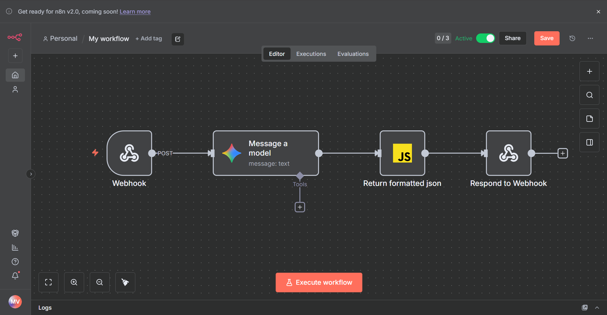

<h1 align="center">Grammaid</h1>

<div align="center">
   
</div>

<p align="center">
  
  
  
  
  
  
  
  
</p>

<h2 align="center">🇬🇧 AI-Powered English Essay Correction Platform</h2>

<p align="center">
  <a href="#about">About</a> •
  <a href="#features">Features</a> •
  <a href="#layout">Layout</a> •
  <a href="#technologies">Technologies</a> •
  <a href="#getting-started">Getting Started</a> •
  <a href="#author">Author</a>
</p>

## 📝 About

**Grammaid** is a web application developed as a final paper for the Computer Science degree at **UFAM (Federal University of Amazonas)**. 

The platform leverages **Large Language Models (LLMs)** to provide automated, detailed, and proficiency-aware feedback on English essays. It aims to assist students in improving their writing skills by offering instant corrections, suggestions, and grading based on standardized criteria (CEFR levels).

## ✨ Features

- **Automated Essay Correction**: Instant feedback on grammar, vocabulary, coherence, and cohesion.
- **Proficiency Levels**: Supports Basic, Intermediate, and Advanced levels (A1-C2) with adapted grading criteria.
- **Detailed Annotations**: Specific error highlighting with explanations and correction suggestions.
- **Progress Tracking**: Dashboard to monitor user performance and essay history.
- **Admin Tools**: Interface for creating and managing essay proposals.

## 🎨 Layout

### 📌 Essay Proposals
Select from a variety of essay topics tailored to different difficulty levels.
<div align="center">
  
</div>

### 📝 Correction Overview
Get an overall grade and general feedback on your writing performance.
<div align="center">
  
</div>

### 🔍 Detailed Feedback
Interactive review with specific error annotations and improvement suggestions.
<div align="center">
  
</div>

### 💡 Text Suggestions
AI-powered suggestions to rewrite sentences for better clarity and flow.
<div align="center">
  
</div>

### 🚀 User Progression
Visual tracking of user level advancement (Basic → Intermediate → Advanced).
<div align="center">
  
</div>

### 🤖 AI Workflow (n8n)
The backend orchestration uses n8n to process texts through LLMs.
<div align="center">
  
</div>

## 🛠 Technologies

The project follows a Monorepo structure with **Docker** containerization.

### Frontend
- **Framework**: [Next.js 15](https://nextjs.org/) (React 19)
- **UI Library**: [Material UI (MUI)](https://mui.com/)
- **Language**: TypeScript

### Backend
- **Runtime**: [Node.js](https://nodejs.org/)
- **Framework**: [Express.js](https://expressjs.com/)
- **ORM**: [Prisma](https://www.prisma.io/)
- **Database**: [MySQL 8.4](https://www.mysql.com/)
- **Validation**: Joi

### DevOps & Tools
- **Containerization**: Docker & Docker Compose
- **Orchestration**: n8n (Workflow Automation)

## 🚀 Getting Started

### Prerequisites
- [Docker](https://www.docker.com/) and Docker Compose installed.
- Node.js (for local development without Docker, optional).

### Installation

1. **Clone the repository**
   ```bash
   git clone https://github.com/your-username/grammaid.git
   cd final-paper
   ```

2. **Configure Environment Variables**
   Copy the example environment files and configure them:
   
   Root:
   ```bash
   cp env.example .env
   ```
   
   Backend:
   ```bash
   cp backend/env.example backend/.env
   ```
   
   Frontend:
   ```bash
   cp frontend/env.example frontend/.env
   ```

3. **Run with Docker**
   Start all services (Database, Backend, Frontend, PHPMyAdmin):
   ```bash
   docker compose up
   ```

4. **Access the Application**
   - **Frontend**: `http://localhost:3000`
   - **Backend API**: `http://localhost:6677`
   - **PHPMyAdmin**: `http://localhost:8282`

## 👤 Author

Developed by **Micael** as a Computer Science Undergraduate Thesis at **UFAM**.

